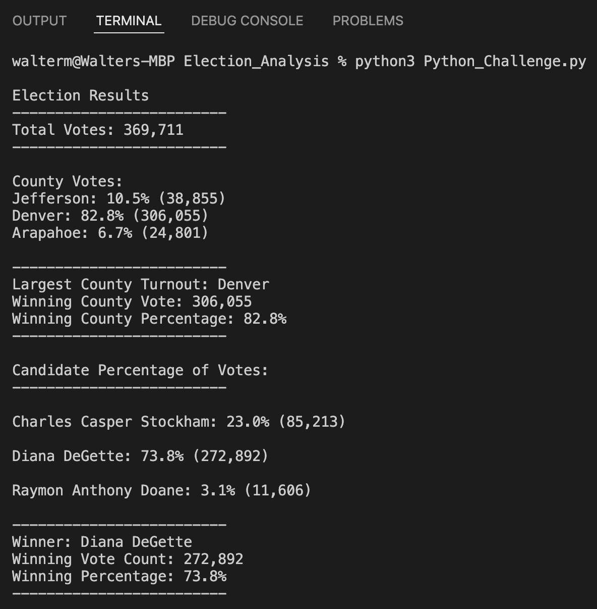
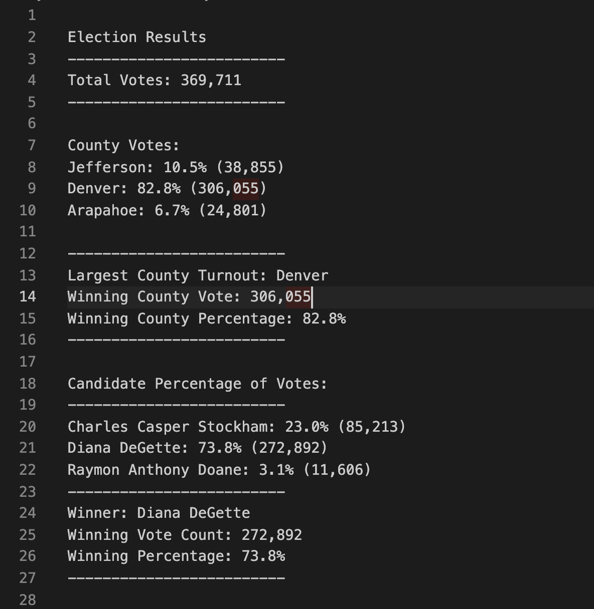

# Election_Analysis
Using Python to analyze data.

## Project Overview
A Colorado Board of Elections has requested to complete the election audit of a recent local congressional election.

- Calculate the total number of votes.
- Get a complete list of candidates who received votes.
- Total number of votes each candidate received.
- Total number of votes each candidate received.
- Percentage of votes each candidate won.
- Calculate the winner of the election based on popular vote.

## Resources
[election_results.csv](https://github.com/WalterMarikwa/Election_Analysis/blob/main/Resources/election_results.csv)

Software: Python 3.7.6, Visual Studio

### Deliverable 1

### Deliverable 2

## Summary
In this calculation according Election Results, There were 369,711 total votes and the overall winner was Diana DeGette.
- Jefferson county has 10.5% total percentage with a total votes of 38,855.
- Denver county has the 82.8% total percentage with a total votes of 306,055.
- Arapahoe county has 6.7% total percentage with a total votes of 24,801.

